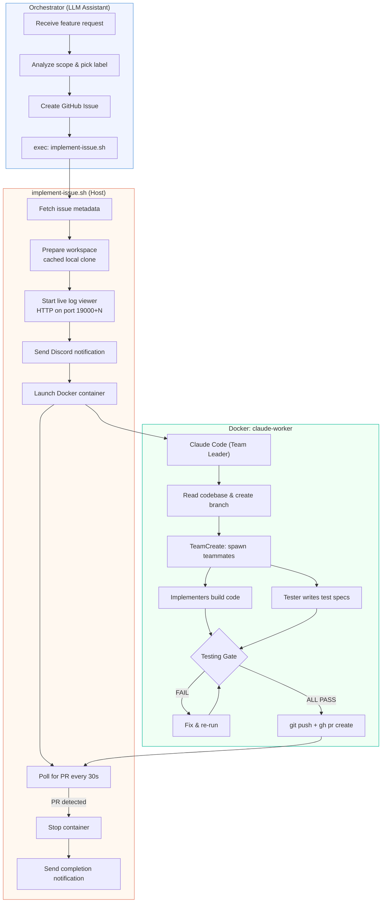
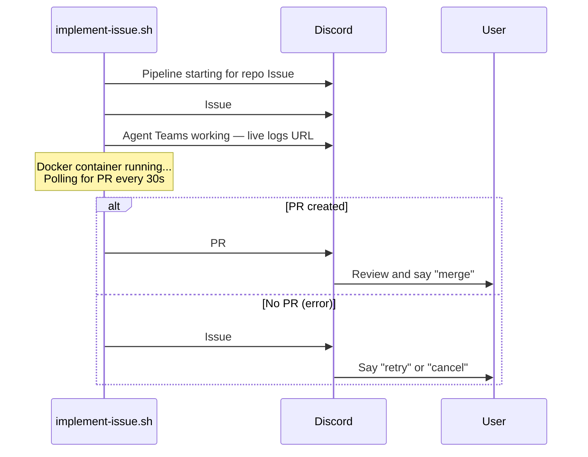
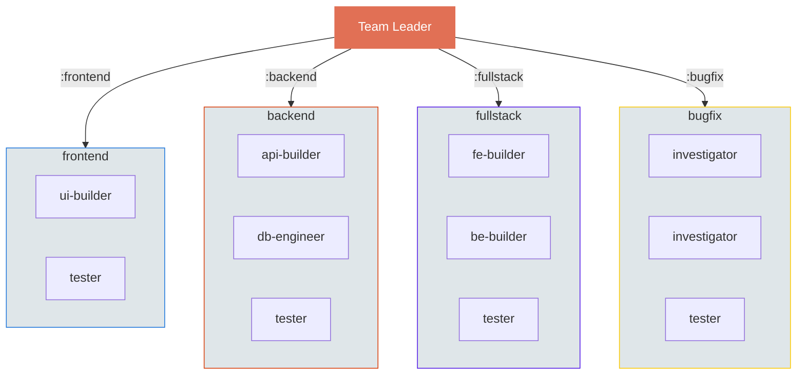

# Code Build Pipeline

Automated development pipeline that turns feature requests into pull requests using Claude Code Agent Teams in Docker.


## Architecture



## Prerequisites

- **Docker**
- **GitHub CLI** (`gh`) — authenticated via `gh auth login`
- **Node.js** (for Claude Code CLI)
- **Python 3** (for live log viewer)

## Environment Variables

| Variable | Required | Description |
|----------|----------|-------------|
| `ANTHROPIC_API_KEY` | Yes | Anthropic API key. Auto-resolved from `~/.openclaw/agents/main/agent/auth-profiles.json` if not set. |
| `GITHUB_TOKEN` | No | GitHub token. Auto-resolved from `gh auth token` if not set. |
| `DISCORD_CHANNEL_ID` | Yes | Discord channel ID for pipeline notifications. |
| `OPENCLAW_BIN` | No | Path to OpenClaw CLI binary. Default: `/opt/homebrew/bin/openclaw` |

## Setup

### 1. Clone this repo

```bash
git clone https://github.com/caesar-is-great/code-build-pipeline.git
cd code-build-pipeline
```

### 2. Build the Docker image

```bash
docker build -t claude-worker ./pipeline/
```

Verify:
```bash
docker run --rm claude-worker --version
```

### 3. Set environment variables

```bash
export ANTHROPIC_API_KEY="sk-ant-..."
export DISCORD_CHANNEL_ID="your-discord-channel-id"
```

### 4. Run

```bash
# Create a GitHub issue first, then:
./pipeline/implement-issue.sh <owner/repo> <issue_number>
```

## Notifications

The script sends Discord messages at each stage via the OpenClaw CLI (`openclaw message send`). No bot token needed in the script environment — it uses the running OpenClaw gateway.



## Live Log Viewer

Each run starts a local HTTP server that streams Docker output with 3-second auto-refresh:

```
http://<local-ip>:<port>
```

Port = `19000 + issue_number` (e.g., issue #42 -> port 19042).

The URL is included in the Discord notification.

## Labels and Team Composition

| Label | Team | Use case |
|-------|------|----------|
| `auto-implement:frontend` | ui-builder + tester | UI changes, screens, components |
| `auto-implement:backend` | api-builder + db-engineer + tester | API, DB, server logic |
| `auto-implement:fullstack` | fe-builder + be-builder + tester | Both layers |
| `auto-implement:bugfix` | investigator x2 + tester | Bug fixes with regression tests |
| `auto-implement` | auto-composed + tester | Unclear scope, AI decides |

Every team always includes a **mandatory tester** who reads acceptance criteria, writes tests, runs the full suite, and blocks PR creation until all tests pass.



## Multi-Issue (Large Features)

Features spanning multiple layers are split into sequential phases:

```
Root Issue #10: "Add payment system"
  |-- Sub-issue #11: Phase 1 - Backend (API + DB)
  |-- Sub-issue #12: Phase 2 - Frontend (UI)
  |-- Sub-issue #13: Phase 3 - E2E tests
```

Sub-issues are created in parallel, executed sequentially.

## File Structure

```
code-build-pipeline/
  pipeline/
    implement-issue.sh        # Main script: clone, docker, poll, notify
    Dockerfile                # claude-worker image (Ubuntu + Node 22 + gh + Claude Code)
  skills/auto-implement/      # Orchestrator skill files
    SKILL.md                  # 5-step pipeline flow
    labels.md                 # Scope analysis + label selection
    repos.md                  # Known repos and tech stacks
    issue-template.md         # Issue body strategy + template routing
    multi-issue.md            # Large feature orchestration
    reporting.md              # 5 notification checkpoints + polling
    cleanup.md                # Merge + cancel + status flows
    errors.md                 # Error scenarios and fixes
    templates/                # Label-specific issue body templates
      frontend.md
      backend.md
      fullstack.md
      bugfix.md
      generic.md
      sub-issue.md
```

## Monitoring

```bash
# List running pipeline containers
docker ps --filter name=pipeline-

# Shell into a running container
docker exec -it pipeline-owner-repo-7 bash

# Inside the container:
ls /workspace/                       # Working files
git log --oneline                    # Commits
tmux list-sessions                   # Agent Teams sessions

# View container logs
docker logs -f pipeline-owner-repo-7

# Check status file
cat /tmp/pipeline-owner-repo-7.status
```

## Troubleshooting

```bash
# Force kill a stuck container
docker kill pipeline-owner-repo-7

# Kill all pipeline containers
docker ps --filter name=pipeline- -q | xargs docker kill

# Rebuild image after Dockerfile changes
docker build -t claude-worker ./pipeline/

# Clean up stopped containers
docker container prune -f
```

## Orchestrator Setup (OpenClaw)

This section explains how to wire the pipeline into an OpenClaw instance. Adapt paths for your environment.

### 1. Clone the repo

```bash
git clone https://github.com/caesar-is-great/code-build-pipeline.git ~/Projects/claude-pipeline
```

### 2. Copy skill files

```bash
cp -r ~/Projects/claude-pipeline/skills/auto-implement \
  ~/.openclaw/workspace/skills/auto-implement
```

This gives your orchestrator the 5-step pipeline flow, issue templates, error handling, and cleanup procedures.

### 3. Configure exec-approvals

Add the pipeline script, `gh`, and `docker` to `~/.openclaw/exec-approvals.json` so the orchestrator can run them without manual approval:

```json
{
  "defaults": {
    "security": "allowlist",
    "ask": "on-miss",
    "allowlist": [
      { "pattern": "/opt/homebrew/bin/gh" },
      { "pattern": "/usr/local/bin/docker" },
      { "pattern": "~/Projects/claude-pipeline/pipeline/implement-issue.sh" }
    ]
  }
}
```

Adjust paths to match your system (`which gh`, `which docker`).

### 4. Add pipeline info to TOOLS.md

Add a section to `~/.openclaw/workspace/TOOLS.md` so the orchestrator knows where things are:

```markdown
### Claude Pipeline (auto-implement)

- Script: `~/Projects/claude-pipeline/pipeline/implement-issue.sh`
- Docker image: `claude-worker` (build: `docker build -t claude-worker ~/Projects/claude-pipeline/pipeline/`)
- Container naming: `pipeline-<owner>-<repo>-<issue_number>`
- Repo cache: `~/.pipeline/repos/<repo>`
- Workspaces: `~/.pipeline/worktrees/<repo>-<issue>`
- Status files: `/tmp/pipeline-<owner>-<repo>-<issue>.status`
- exec-approvals: `gh`, `docker`, `implement-issue.sh` pre-approved
```

### 5. Add skill routing to AGENTS.md

Add this to `~/.openclaw/workspace/AGENTS.md` so the orchestrator routes build/fix requests to the pipeline instead of trying to implement manually:

```markdown
### Skill Routing (IMPORTANT)

When someone asks you to **build a feature, fix a bug, or make code changes**,
use the `auto-implement` skill. Do NOT try to implement manually or spawn
sub-agents. The auto-implement skill handles everything: issue creation,
Docker containers, Agent Teams, testing, and PR creation.

Flow: Read the skill's SKILL.md -> follow the steps -> use exec to run implement-issue.sh.

IMPORTANT: Execute each pipeline step immediately without asking for confirmation.
The user already approved by requesting the feature/fix. Do not pause between
issue creation and implementation — proceed automatically.
```

### 6. Add known repos

Edit `~/.openclaw/workspace/skills/auto-implement/repos.md` with your repositories:

```markdown
## owner/repo

- **Stack**: React Native + Expo
- **Language**: TypeScript
- **Build**: Yarn 4
- **Tests**: Jest
- **CI**: GitHub Actions
```

This helps the orchestrator pick the right label and team composition without analyzing the repo from scratch each time.

### 7. Add GitHub labels to your repos

Create these labels on each repo you want to use with the pipeline:

| Label | Color | Description |
|-------|-------|-------------|
| `auto-implement` | `#0E8A16` (green) | Default — AI picks team |
| `auto-implement:frontend` | `#1D76DB` (blue) | UI changes |
| `auto-implement:backend` | `#D93F0B` (red) | API/DB changes |
| `auto-implement:fullstack` | `#5319E7` (purple) | Both layers |
| `auto-implement:bugfix` | `#FBCA04` (yellow) | Bug fixes |

```bash
# Example: create all labels at once
REPO="owner/repo"
gh label create "auto-implement" --color 0E8A16 --repo $REPO
gh label create "auto-implement:frontend" --color 1D76DB --repo $REPO
gh label create "auto-implement:backend" --color D93F0B --repo $REPO
gh label create "auto-implement:fullstack" --color 5319E7 --repo $REPO
gh label create "auto-implement:bugfix" --color FBCA04 --repo $REPO
```

### Workspace Overview

After setup, your full orchestrator workspace should look like:

```
~/.openclaw/
  openclaw.json                   # Daemon config (model, channels, gateway port)
  exec-approvals.json             # Pre-approved binaries (gh, docker, implement-issue.sh)
  .env                            # Secrets (API keys, tokens)
  workspace/
    AGENTS.md                     # Boot sequence + skill routing + behavior rules
    SOUL.md                       # Orchestrator personality and identity
    USER.md                       # Info about the user (preferences, context)
    TOOLS.md                      # Local paths, environment-specific references
    MEMORY.md                     # Long-term memory (curated, cross-session)
    IDENTITY.md                   # Public-facing identity details
    HEARTBEAT.md                  # Periodic task checklist (checked every ~30min)
    memory/                       # Daily session logs
      2026-02-09.md
    skills/
      auto-implement/             # <-- Copied from this repo
        SKILL.md                  # 5-step pipeline flow
        labels.md                 # Scope analysis + label selection
        repos.md                  # Known repos (add yours here)
        issue-template.md         # Issue body strategy
        multi-issue.md            # Large feature orchestration
        reporting.md              # Notification checkpoints
        cleanup.md                # Merge + cancel flows
        errors.md                 # Error scenarios
        templates/                # Issue body templates by label
```

**What each file does:**

| File | Role | Pipeline-relevant? |
|------|------|--------------------|
| `AGENTS.md` | Boot sequence: what to read on startup, safety rules, skill routing | Yes — skill routing section triggers the pipeline |
| `SOUL.md` | Personality, tone, identity of the orchestrator | No — but defines how it communicates results |
| `USER.md` | User preferences, context, working style | No — but helps orchestrator tailor messages |
| `TOOLS.md` | Local paths, environment details, command references | Yes — pipeline paths and commands |
| `MEMORY.md` | Persistent memory across sessions | No — orchestrator's long-term memory |
| `HEARTBEAT.md` | Checklist for periodic heartbeat polls (~30min) | Optional — can add pipeline status checks |
| `exec-approvals.json` | Allowlist for binaries the orchestrator can run without asking | Yes — must include gh, docker, implement-issue.sh |
| `openclaw.json` | Daemon config: model, Discord/Telegram channels, gateway port | Yes — defines which channels receive notifications |

The orchestrator can now handle requests like "Add dark mode to owner/repo" end-to-end: analyze scope, create issue, run pipeline, notify on completion, merge on approval.

## License

MIT
